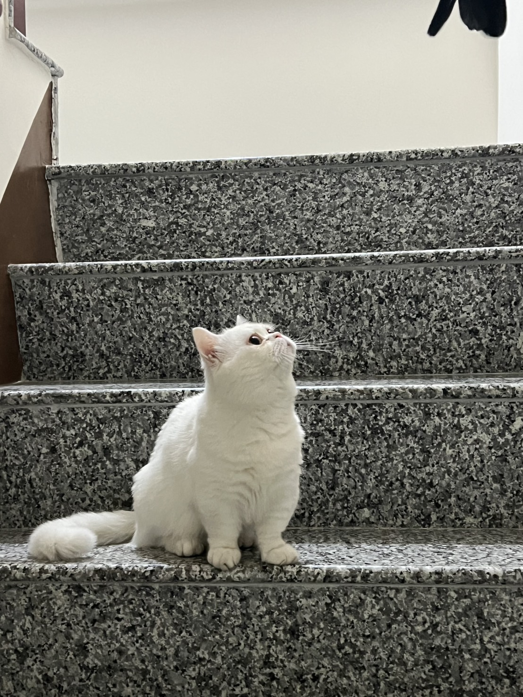
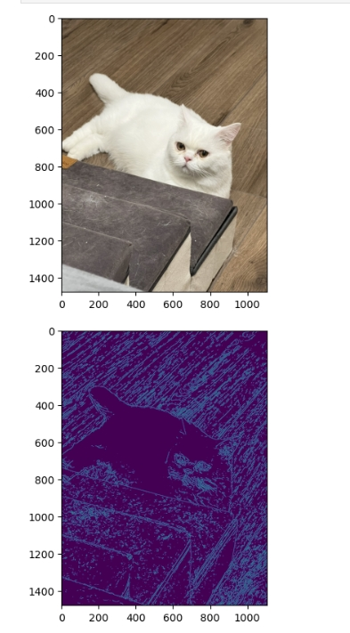

# 作業連結

# 個人介紹

| 項次 | 項目     | 內容                         |
|------|----------|------------------------------|
| 1    | 姓名     | 楊全全                       |
| 2    | 性別     | 男                           |
| 3    | 職稱     | 董事長                   |
| 4    | 圖片     |                        |
| 5    | 公司     | 楊承翰的家         |
| 6    | 聯絡信箱 | j113252122@nkust.edu.tw    |

  
# 課程line群組

  
# 喜歡的影片

 影片取自 youtube

# 程式碼的貓咪

     ／＞　 フ  
    | 　_　_|   
  ／` ミ＿xノ   
 /　　　　 |   
/　 ヽ　　 ﾉ   
│　　|　|　|  
／￣|　　 |　|   
(￣ヽ＿_ヽ_)__)  
＼二)   |

# 作業連結

# 程式碼

import cv2
from matplotlib import pyplot as plt

img = cv2.imread('cat3.jpg')
im2 = img[:,:,::-1]              # Convert image as rgb
plt.imshow(im2)
plt.show()

im3 = cv2.cvtColor(img, cv2.COLOR_BGR2GRAY)  # 轉成灰階
im3 = cv2.medianBlur(im3, 7)                 # 模糊化，去除雜訊
output = cv2.Canny(im3, 36, 36)              # 偵測邊緣

plt.imshow(output)
plt.show()

